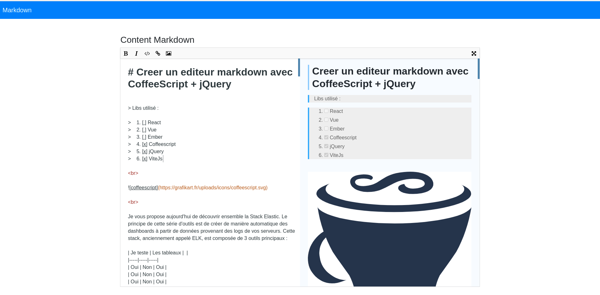

# WIPBICTBF : Work in progress but it's close to be finished



[DEMO](https://arbims.github.io/)

# technologies used
  * viteJs
  * coffeescript
  * jQuery

## How it works

To transform a textarea in an markdown editor you just have to create a new editorMD instance

```html
<div class="container">
  <textarea class="editor_custom"> </textarea>
</div>
```

```javascript
$('.editor_custom').editorMD();
```
You can pass options as the second parameter to activate sync Scroll

```javascript
$('.editor_custom').editorMD({
  syncScroll: true
});
```

## Options

I created options for my needs, if you have some new ideas, PR are welcomed.

## Contributing

Before you can start you have to download you have to install npm dependencies, bower dependencies, then start gulp serve task

- npm install 
- npm run dev
- npm run build

Then you can edit src/mdeditor.coffee to do some edits.

## Todo
